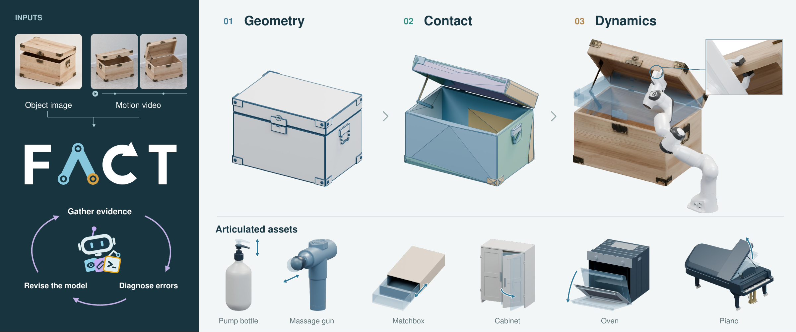

<div align="center">

# FACT: Fidelity-Aware Construction of Articulated Twins

[Kuixiang Shao](https://openreview.net/profile?id=~Kuixiang_Shao1) · [Chuansen Nie](https://openreview.net/profile?id=~Chuansen_Nie1) · [Yinuo Bai](https://scholar.google.com/citations?user=9VoenOYAAAAJ&hl=zh-CN&oi=ao) · [Jiayuan Gu](https://jiayuan-gu.github.io/) · [Jingyi Yu](https://www.yu-jingyi.com/)

**ShanghaiTech University**

[](https://l-avenir.github.io/fact-project-page/)


https://l-avenir.github.io/fact-project-page/

</div>

FACT is an agentic framework that progressively constructs articulated twins with **geometry, contact, and dynamic fidelity**. It reconstructs editable articulated geometry from images, refines collision proxies for reliable interaction, and calibrates physical response models from passive-motion videos.

[](https://l-avenir.github.io/fact-project-page/)

## BibTeX

```bibtex
% BibTeX entry will be added soon.
```

---

Website adapted from [Roman Hauksson-Neill’s project page template](https://research-template.roman.technology), based on [Eliahu Horwitz’s template](https://github.com/eliahuhorwitz/Academic-project-page-template) and [Nerfies](https://nerfies.github.io/). Template licensed under [CC BY-SA 4.0](https://creativecommons.org/licenses/by-sa/4.0/); research content and media are separate from the template license.
